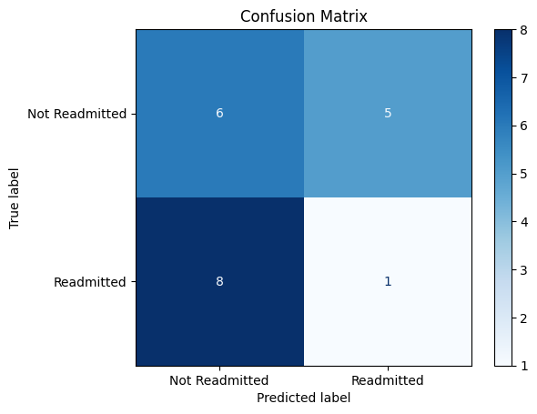

# 🏥 Patient Readmission Prediction with Gradient Boosting

This Jupyter notebook demonstrates how to build a simple machine learning model to predict hospital patient readmission using a synthetic dataset. The workflow uses Python and scikit-learn.

## Steps Overview

1. 📦 **Install Libraries**  
   Installs required Python libraries (scikit-learn, pandas, numpy, matplotlib).

2. 📚 **Import Libraries**  
   Imports all necessary packages for data handling, modeling, and visualization.

3. 🏗️ **Create Synthetic Dataset**  
   Generates a dataset with features: `age`, `length_of_stay`, `previous_admissions`, and target: `readmitted`.

4. ✂️ **Split Data**  
   Splits the data into training and testing sets.

5. 🤖 **Train Model**  
   Trains a `GradientBoostingClassifier` on the training data.

6. 🔮 **Predict**  
   Uses the trained model to predict readmission on  test set.

7. 📊 **Evaluate with Confusion Matrix**  
   Computes and displays the confusion matrix for model evaluation.

   Example Confusion Matrix:

   |                | Predicted: Not Readmitted | Predicted: Readmitted |
   |----------------|:------------------------:|:--------------------:|
   | **Actual: Not Readmitted** |         10               |         5            |
   | **Actual: Readmitted**     |         8                |         1            |

   *(Your actual results may vary)*

   

8. 🧮 **Calculate Precision & Recall**  
   Prints out the precision and recall metrics for the model.

---

 ## 📈 Results

- **Precision:** 0.17  
- **Recall:** 0.11  

---

## 🚀 How to Run

1. Open the notebook in Jupyter or Google Colab.
2. Run each cell in the order.
3. Review the outputs and confusion matrix plot.

---

## 📝 Notes

- The dataset is synthetic and for demonstration purposes only.
- The model and metrics can be improved with real data and feature engineering.

---
